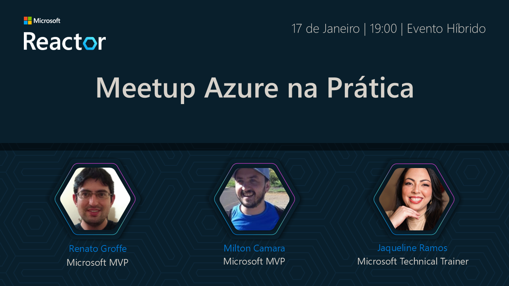
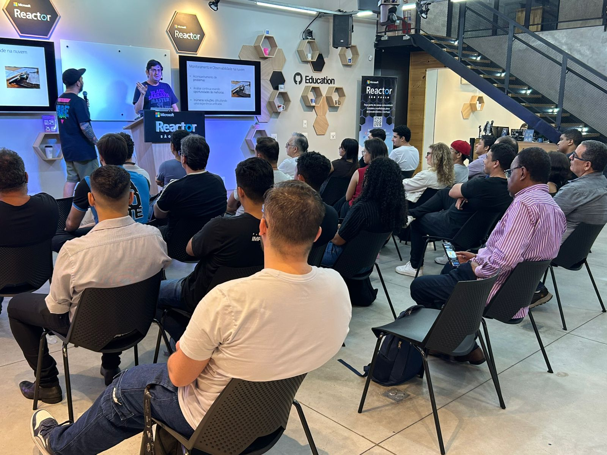
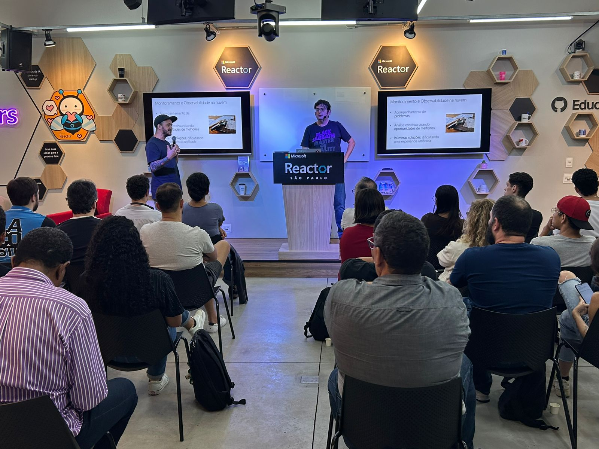
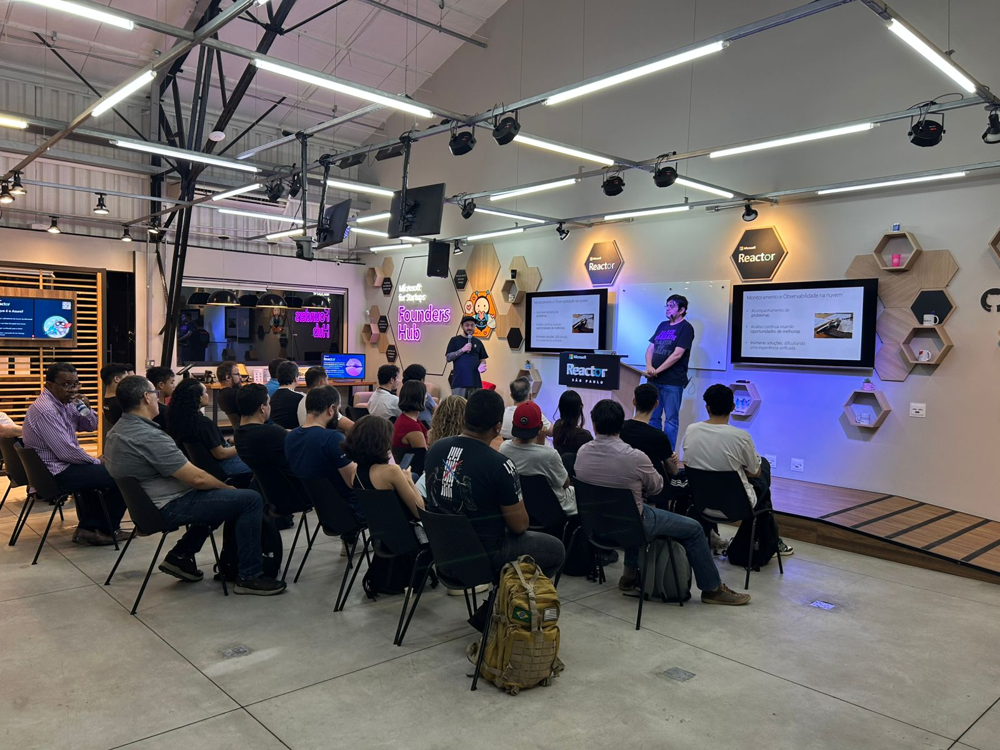

# Meetup Azure na Prática - 17/01/2025
Fotos e informações gerais de evento presencial realizado pela comunidade Azure na Prática em 17/01/2025 na cidade de São Paulo-SP.

Organizadores:
- **Renato Groffe (Microsoft MVP, Docker Captain, MTAC)**
- **Milton Camara Gomes (Microsoft MVP, MTAC)**

Número de participantes: **33 pessoas**

---

Apresentações que aconteceram durante o evento:

_# Azure Managed Grafana: monitoramento na nuvem com eficiência e flexibilidade_

Palestrantes:
- Renato Groffe - Microsoft MVP, Docker Captain, MTAC
- Milton Camara Gomes - Microsoft MVP, MTAC

Tecnologias abordadas: **Docker, Kubernetes, KEDA, Azure Kubernetes Service (AKS), Grafana, Prometheus, Azure Container Apps, Azure Monitor, Log Analytics, Application Insights...**

_# A Jornada da Modernização: Como Microsoft Azure e Copilot podem ajudar nesta empreitada!_

Palestrante: Jaqueline Ramos - Technical Trainer LATAM/Americas na Microsoft, ex-MVP Microsoft (DevOps e Azure) e MVP Alumini

Tecnologias e tópicos abordados: **Microsoft Azure, Copilot, Azure DevOps, GitHub, Cloud Adoption Framework...**

---

Acesse este [**link**](/img/) para visualizar todas as fotos das apresentações.

Para acessar a gravação do evento no **YouTube** clique neste [**link**](https://www.youtube.com/watch?v=1qzRKWwZoQs).

Este evento foi uma parceria entre a comunidade [**.NET SP**](https://www.youtube.com/azurenapratica) e o [**Microsoft Reactor**](https://www.meetup.com/Microsoft-Reactor-Sao-Paulo/).

Formulário utilizado para inscrições: [**Microsoft Reactor**](https://developer.microsoft.com/pt-br/reactor/events/24722/?wt.mc_id=meetup_24722_webpage_reactor)

Local: Microsoft Reactor - Rua Jaceru, 225 - Vila Gertrudes - São Paulo - SP - CEP: 04705-000

Deixamos aqui nossos agradecimentos ao Victor Temple e à Larissa Cyganski pela oportunidade e todo o apoio para promovermos esta edição local do .NET Conf no Microsoft Reactor em São Paulo-SP.

---

